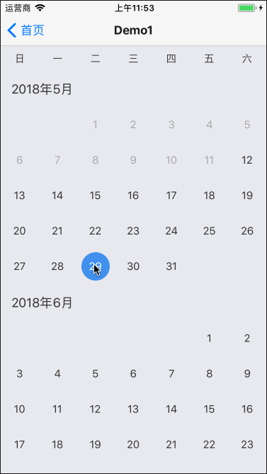
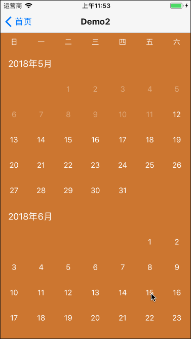
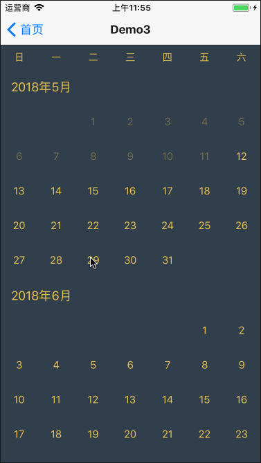
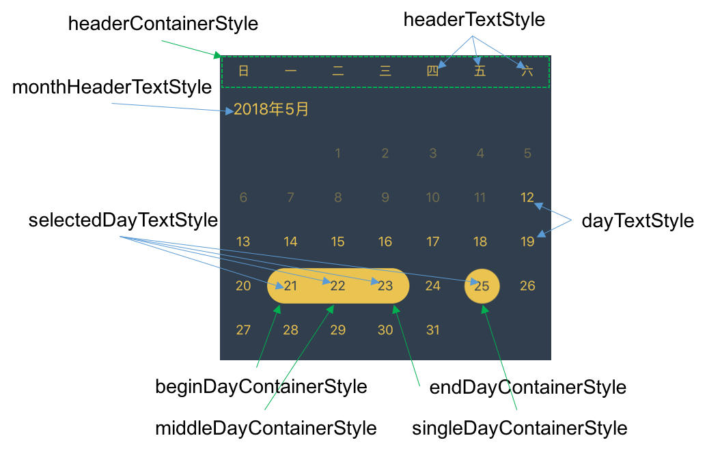

## DraggableCalendar

A calendar component supporting dragging operation.

## 1. Examples

Download the repository, cd the examples directory, and run it on simulator.

```bash
git clone git@github.com:SmallStoneSK/react-native-draggable-calendar.git
cd examples
react-native run-ios      # for ios
react-native run-android  # for android
```

<p align="center">
  
  
  
</p>

## 2. Usage

At first, you should install react-native-draggable-calendar. Like this:

```bash
npm install react-native-draggable-calendar --save
```

1. For basic usage, you can use it as following:

```javascript
export class BasicUsageDemo extends Component {

  constructor(props) {
    super(props);
  }

  onGetTime = () => {
    // you can get the selected time.
    console.log('onGetTime: ', this._calendar.getSelection());
  };

  onSelectionChange = (newSelection) => {
    // when selected time changes, this func will be called.
    console.log('onSelectionChange', newSelection);
  };

  render() {
    return (
      <View style={{flex: 1}}>
        <DraggableCalendar
          ref={_ => this._calendar = _}
          onSelectionChange={this.onSelectionChange}
        />
        <TouchableOpacity onPress={this.onGetTime} style={{
          justifyContent: 'center', alignItems: 'center',
          left: 0, right: 0, bottom: 0, paddingVertical: 15,
          position: 'absolute', backgroundColor: '#4291EF'
        }}>
          <Text style={{color: '#FFF'}}>Get Time</Text>
        </TouchableOpacity>
      </View>
    );
  }
}
```

2. As it has provided a default style, you can use it as following for in-depth customization.

```javascript
export class CustomizationDemo extends Component {
  _genStyles() {
    return {
      style: styles.draggableContainer,
      headerTextStyle: styles.dayText,
      monthHeaderTextStyle: styles.dayText,
      dayTextStyle: styles.dayText,
      selectedDayTextStyle: styles.selectedDayText,
      singleDayContainerStyle: styles.selectedDayContainer,
      beginDayContainerStyle: styles.selectedDayContainer,
      middleDayContainerStyle: styles.selectedDayContainer,
      endDayContainerStyle: styles.selectedDayContainer
    };
  }
  render() {
    return (
      <DraggableCalendar {...this._genStyles()}/>
    );
  }
}

const styles = StyleSheet.create({
  draggableContainer: {
    backgroundColor: '#303E4D'
  },
  dayText: {
    color: '#EAC351'
  },
  selectedDayText: {
    color: '#303E4D'
  },
  selectedDayContainer: {
    backgroundColor: '#EAC351'
  }
});
```

For detailed xxxStyle meaning, you can see the following picture:



## 3. Others

### 1. Decide how many month to render.

You have two ways to deside this.

1. pass fullDateRange and availableDateRange. Like this:

```javascript
<DraggableCalendar
  fullDateRange={[new Date(2018, 4, 1, 0, 0, 0), new Date(2018, 6, 31, 0, 0, 0)]}
  availableDateRange={[new Date(2018, 4, 21, 0, 0, 0), new Date(2018, 6, 31, 0, 0, 0)]}
  />
```

So, the date between 5.1~5.20 will not be selected. You'd better specify the first day of a month and the last day of a month to fullDateRange.

2. pass maxDays. Like this:

```javascript
<DraggableCalendar maxDays={180}/>
```

In this way, the availableDateRange will be \[today, today + 180\]. And the fullDateRange will be \[first day of this month, last day of the month containing (today + 180)\].

### 2. Customize your render content.

If you are not satisfied with the customization above, you can even pass renderMonthHeader/renderDay function to DraggableCalendar. Like this:

```javascript
<DraggableCalendar
  renderDay={data => this.yourRenderDay(data)}
  renderMonthHeader={identifier => this.yourRenderMonthHeader(identifier)}
  />
```

**Note**

The data passed to yourRenderDay is an object: 

```javascript
{
  date        // a date obj
  status      // indicating its selected status. (enum value: see DAY_STATUS in Helper.js)
  available   // indicating whether this day is touchable
}
```

the identifier passed to yourRenderMonthHeader is a string:

```javascript
'2018-05'   // you can use identifier.split('-') to get the year and month
```
